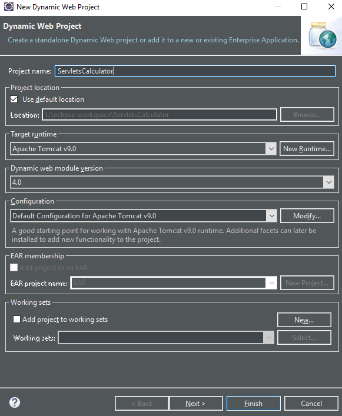

# Steps to run Servlet/JSP application in Eclipse IDE
Pre-requistics - Apache Tomcat Server (or any other server) installed and configured properly 
### Servlets
1. Open Eclipse IDE
2. Goto File -> New -> Dynamic Web Application
3. Give any name for the Project , for example - ServletCalculator

4. Click on next, there are no changes to made here, click next again.
5. Make sure that the checkbox generation web.xml deployment descriptor
6. Click on finish, this will create the project

7. Create a servlet file in the Java Resources folder
   Right click on src folder -> goto New -> Servlet
   
8. Create a html file in the WebContent folder
   Right click on WebContent folder -> goto New -> HTML File
   Name it as servlet_index.html
   
9. Write the appropriate code in servlet file and index file respectively
10. Open web.xml file present in the WEB-INF folder of WebContent 
   Declare and define the classes/servlets and the HTML File
   
   Below is the snapshot of the project explorer
   

11. Save the files and run the application on server

12. You will see the name of the server installed and configured 
    
    
    
    Click on finish and you are done !

### JSP
Steps 1-6 of the servlets remain same for creating JSP Application
Give the project name as JSPCalculator

7. Create a JSP File
   Right click on WebContent -> New -> JSP File
   Give the name as JSPCalculator ,click on next and then Finish
   

8. Create a html file in the WebContent folder
   Right click on WebContent folder -> goto New -> HTML File
   Name it as jsp_index.html

9. Write the appropriate code in servlet file and index file respectively
10. Open web.xml file present in the WEB-INF folder of WebContent 
    Since there is no classe to be declared and defined,keep only the the HTML File. 
    JSP File will not defined here
   
   Below is the snapshot of the project explorer
   

11. Save the files and run the application on the server

    

Click on finish and you are done ! 
